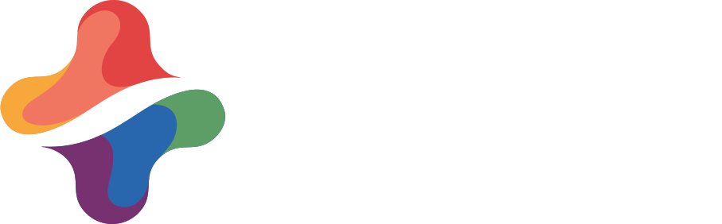

# Keep It Neutral | Marketing Campaign



About Keep It Neutral. If we have a live site, put it [here](google.ca).

## Built with
* **HTML5**
* **SASS/CSS3**
* **JavaScript**
* **PHP**
* **MySQL**

## Dev Area

#### How to Use Gulp

You need these to run the program:

* NPM
* Node JS
* Gulp Dependencies

1. Clone the repo
    ```
    git clone https://github.com/mariamkhalifa/Chang_Kayla_Khalifa_Mariam_Gajjar_Kahani_Tsao_Sandra_Valero_Luiza_FIP.git
    ```
2. Open the folder and install the packages: `npm install`
3. To use gulp, run the following functions in your terminal
    * Compressing and adding prefixes to SASS: `gulp compile`
    * Compressing images: `gulp crunch`
4. When you're done compressing images, you can transfer the assets from the 'dist' folder into the 'images' folder.
